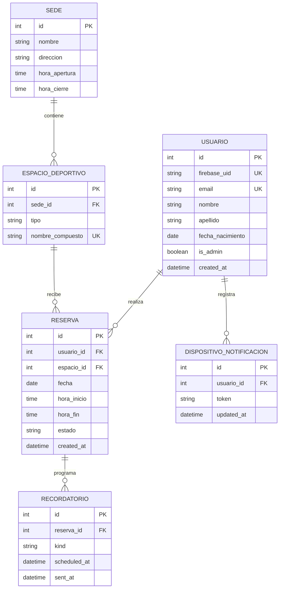

# Modelo de datos

El backend usa una base relacional. Firebase Authentication guarda las credenciales; la base local relaciona cada perfil con el UID Firebase y conserva los datos de negocio.

## Reglas de relación

- `usuario.firebase_uid` vincula el perfil de la aplicación al usuario autenticado de Firebase; la contraseña nunca se almacena en esta base.
- El email identifica el perfil, pero no se modifica desde el endpoint de edición del perfil.
- `espacio_deportivo.nombre_compuesto` se construye con nombre de sede, dirección, tipo y número. Al renombrar una sede, se recalculan los nombres compuestos.
- Cada reserva pertenece a un perfil y a un único espacio deportivo. La API asigna `usuario_id` a partir del Firebase ID token.
- Cada dispositivo pertenece a un usuario. `token` se usa solo para entrega FCM y se elimina al cerrar sesión o cuando Firebase informa que dejó de ser válido.
- Cada recordatorio pertenece a una reserva y es único por tipo (`24h` o `1h`). Las reservas canceladas no generan notificaciones.
